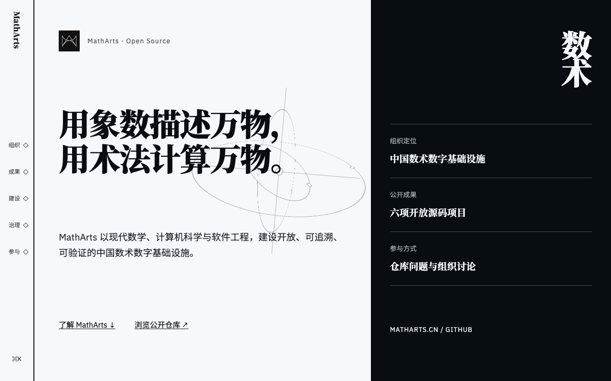

<a href="https://matharts.cn/">
  
</a>

# matharts.cn

本仓库包含 [MathArts 官网](https://matharts.cn/) 源码，并使用 Astro 构建静态网站。

MathArts 以现代数学、计算机科学与软件工程，建设开放、可追溯、可验证的中国数术数字基础设施。

## 开始开发

项目通过 [`mise.toml`](./mise.toml) 固定 Node.js、pnpm 和 nub 版本。nub 使用现有的 `pnpm-lock.yaml` 安装依赖并运行项目脚本。安装 [mise](https://mise.jdx.dev/) 后，准备运行时和项目依赖：

```bash
mise install
nub install
```

启动 Astro 开发服务器：

```bash
nub run dev
```

浏览器打开 `http://localhost:4321`。

## 构建并预览

构建静态网站并启动本地生产预览：

```bash
nub run build
nub run preview
```

## 运行质量检查

运行字体字符清单、Astro 检查、代码检查、格式检查和 Playwright 端到端测试：

```bash
nub run verify
```

本地字体的来源与更新方式参见 [`docs/FONTS.md`](./docs/FONTS.md)。

运行本地生产构建的移动端与桌面端 Lighthouse 审计（需要本机安装 Chrome）：

```bash
nub run lighthouse
```

发布前按项目阈值执行 Lighthouse 门禁：

```bash
nub run lighthouse:check
```

门禁要求移动端 Performance 不低于 90，移动端与桌面端的 Accessibility、Best Practices 和 SEO 均为 100，同时限制 CLS、TBT 和实验室 LCP。HTML 与 JSON 报告写入忽略版本控制的 `output/lighthouse/`。

## 参与 MathArts

- [浏览公开项目](https://github.com/matharts)
- [阅读贡献指南](https://github.com/matharts/.github/blob/main/CONTRIBUTING.md)
- [参与开放讨论](https://github.com/orgs/matharts/discussions)
